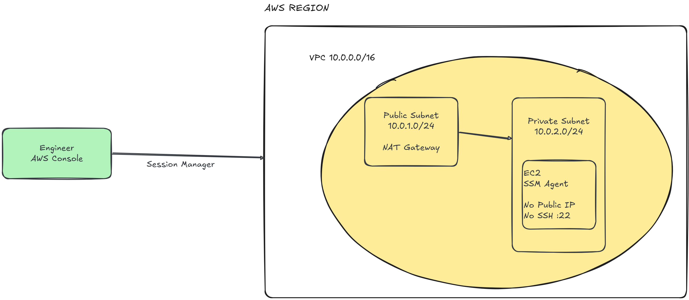
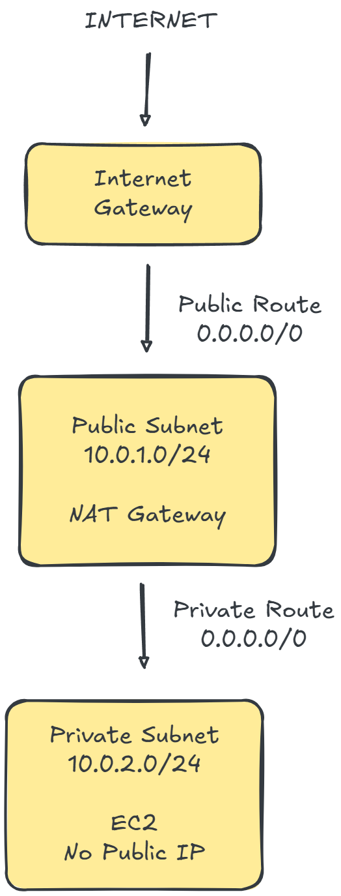

# Architecture

## Target architecture

The project uses a private EC2 workload managed through AWS Systems Manager.



## High-level flow
```bash
        Administrator
            |
            v
     AWS Systems Manager
            |
            v
        SSM Agent
            |
            v
        Private EC2
```
The administrator does not connect directly to the EC2 instance over
TCP/22.

## Network architecture



The environment contains:

- One VPC
- One public subnet
- One private subnet
- Internet Gateway
- NAT Gateway
- Public route table
- Private route table
- EC2 instance

## Traffic model

### Public subnet

```text
Public subnet
     |
     v
Route table
     |
     v
Internet Gateway
     |
     v
  Internet
```
### Private subnet

```text
        Private EC2
            |
            v
    Private route table
            |
            v
        NAT Gateway
            |
            v
    Internet Gateway
            |
            v
        Internet
```

### Management model

Traditional:
```text
            Administrator
                |
               SSH
             TCP/22
                |
                v
               EC2
```
Project:
```text
      Administrator
            |
            v
      Systems Manager
            |
            v
        SSM Agent
            |
            v
           EC2
```

Design principle

The workload should not need to be publicly reachable simply because
administrators need to manage it.